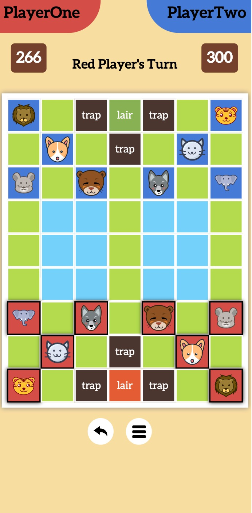
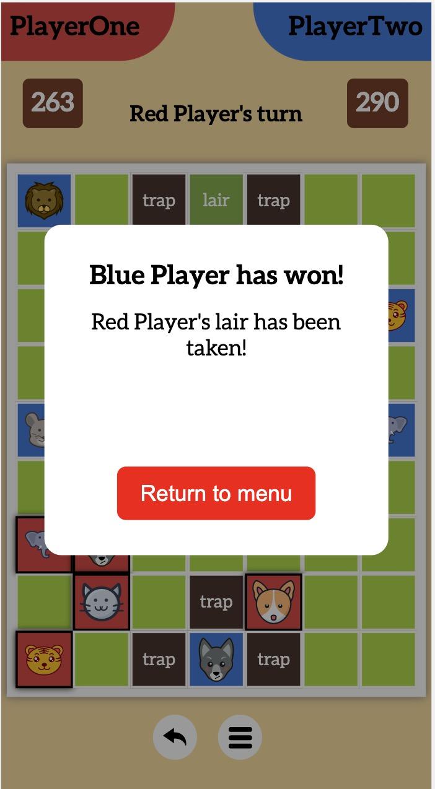

# Jungle Chess
<p float="left">
    
    
</p>


## Overview
Jungle Chess, or Beast Chess, is a traditional Chinese game that survives until modern day. There are many variations and each one of their rules are different. However, at its core, it always about eating the enemy beasts and/or taking their lair. The most popular rule starts with the elephant as the strongest piece, while the rat is the weakest. However, the rat is the only animal which can beat an elephant to keep it in check.
So far, I am only making a single player version of this game. I plan to upgrade it into a multiplayer game in the future. 

## Rules

In my version of Beast Chess, the power order is as follows: elephant > lion > tiger > cheeta > wolf > dog > cat > rat > elephant.

### Movement Rules
Most of the time, beasts can **only move one grid horizontally or vertically next to it at a time while being unable to move into the river(the blue boxes)**. 
<br>Once a player moves one beast, his turn ends and his opponents can now move his beasts. 
<br>However, the **rats are the only one which can go into the river**. When they do, they become invunerable as they are unreachable to other animals. However, they can **no longer attach elephants on the land, nor are they able to eat other rats in the river**.
<br>Besides rats, Tigers and lions can **jump across the river.**

Traps will trap an enemy beast, **render it vunerable**. Any beast from you can take it out while it's in the trap. Friendly trap **has no effect on friendly beasts.**

When a stronger beast meets a weaker one, the stronger one wins and the weaker one is removed from the game. If two beasts are equal, both of them die. It is also legal to move your weaker beast into a stronger enemy, thus sacrificing it.

### Win Condition
Once the enemy lair is taken or all of their beasts are eliminated or a player runs out of time, you win.

## Game Logic
I used **vanilla TypeScript and CSS** to make this game without any framework such as React or Vue, though in hindsight, I definetely made it difficult for myself as I need to mannully manipulate a lot of DOM and I had to rely on web components to seperate html elements into another file.

### Board Visualization
I used an array of array to represent of chess board and its contents. This way, it's easier to add on new features such as undo or even upgrade it into a multiplayer game in the future

```javascript
    this.arr = [
            [-2, 0, 31, 41, 31, 0, -3],
            [0, -6, 0, 31, 0, -7, 0],
            [-8, 0, -4, 0, -5, 0, -1],
            [0, 33, 33, 0, 33, 33, 0],
            [0, 33, 33, 0, 33, 33, 0],
            [0, 33, 33, 0, 33, 33, 0],
            [1, 0, 5, 0, 4, 0, 8],
            [0, 7, 0, 30, 0, 6, 0],
            [3, 0, 30, 40, 30, 0, 2],
        ];
```

-1 to -8 represents elephant to rat of the green team, while 1 to 8 for the red team. 33 represents river terrain. 30 and 31 represents each team's traps
Finally, 40 and 41 represent each lair.
<br>1, -1 elephant of team red and blue
<br>2, -2 lion of team red and blue
<br>3, -3 tiger of team red and blue
<br>, -4 cheeta of team red and blue
<br>5, -5 wolf of team red and blue
<br>6, -6 dog of team red and blue
<br>7, -7 cat of team red and blue
<br>8, -8 rat of team red and blue

### Animal special status
Since everything on the chess board is represented with just a number, I am going to need some special numbers for those special circumstances. 
For animals trapped in enemy traps, their absolute value will increase by 1000.
for example, red elephant will go from 1 to 1001, or blue lion will go from -2 to -1002
Animals inside of their own traps will increase their absolute value by 100
Rats in river will have their value multiplies by 3, namely 8 to 24 or -8 to -24
